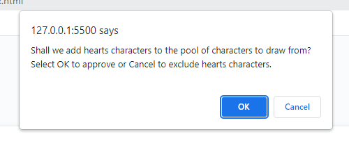

# Password Generator (Bootcamp Challenge 3)

## Introduction and Purpose:

I wrote the "back-end" of this simple password generator as an exercise in JavaScript fundamentals - functions, objects, and arrays. I used it as an opportunity to practice the structuring of JavaScript programs and very rudimentary algorithm design.

## Scenario:

A fictional employee with access to sensitive data wishes for a utility to generate randomised passwords. Various types of characters may be included and excluded in the generation of said password.

## Technical Overview:

The exercise was intended to focus our attention on features of the JavaScript language. We were supplied with a minimalistic web document: a text field and a button with an event listener. No changes were made to this interface, and communication with the user is done primarily through modal dialogs - slightly ungainly but in the spirit of the acceptance criteria.

User input is restricted to valid replies and the password generation process is reset if the user provides invalid criteria or fails to select at least one character set from which to generate a password. The standard options are: uppercase, lowercase, number and/or symbols.

Input anomalies are further written to the central text field to aid the user's understanding of the error of their ways.

The code generates a password based on valid user selections of character sets to be included, and if appropriate regenerates it until the password includes at least one character from each of the character sets approved by the user. The following is an example of a 128-character password that includes uppercase and lowercase characters and special characters, but not numbers:

The code uses object properties to store character sets, and is written to allow expandability - adding new character sets to the storage object will automatically include them in the sequence of user prompts. See, for example, the addition of a hearts property to the original four:

## Results:

The application is currently live on [GitHub Pages](https://tadcos29.github.io/password-generation-trifle/) 

The GitHub repository for the project is: https://github.com/tadcos29/password-generation-trifle

## Potential Issues:

* The math.Random() method is used to generate random numbers, with all the security limitations that entails.

* The validation and regeneration approach is slightly Monte Carlo, and not the most computationally efficient, but given the a priori restrictions on the size of user input, it is probably satisfactory. 

